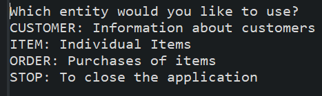
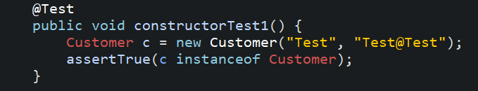
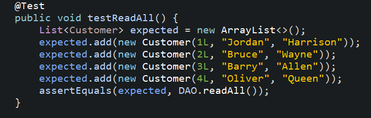
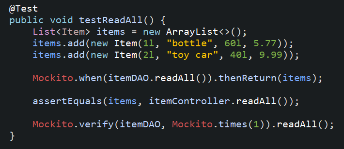

Coverage: 54%
# Inventory Management System - QA Week 5 Individual Project

This inventory management system is a Java based application which is designed to store customer information. This online database contains tables which house orders and items through which a user is able to create, view, update, or delete said orders.

## Getting Started

These instructions will get you a copy of the project up and running on your local machine for development and testing purposes. See deployment for notes on how to deploy the project on a live system.


### Prerequisites

What things you need to install the software and how to install them
1. Java14
2. An IDE of your choice
3. A running local SQL Server
4. Maven
5. Git

To ensure you have javan and maven installed, run the following lines in your terminal
```
java -version
mvn -version
```

### Installing

1. Git bash into your folder and clone this repository down for you to use.

Use this line
```
git clone https://github.com/parthpatel-qa/IMS-Starter.git
```

2. Open this project in your desired IDE

```
In eclipse that would be File>Import>Maven>ExistingMavenProjects>Find the file>Finish
```
<p align="center">
<src="Documentation/Eclipse.png">
</p>


3. I have set the Database URL to a local host but you can change it to anything you require in src/main/java/utils/DBUTils.java
```
DB_URL = "jdbc:mysql://localhost.3306/ims";
```

4. Direct yourself to the Runner.Java and run as Java Application
USERNAME:
```
root
```
PASSWORD:
```
root
```
5. From here you will be able to choose which domain you want to work with or exit the application

<p align="center">

</p>

6. The Simplest way to test whether the system is working choose a domain to work with:
```
Customer
```
7. Then choose a CRUD function
```
Read
```
8. You will see an output of all customers

```
ID   First Name    Surname
----------------------------------
 1   Jordan        Harrison
```


## Running the tests

This project consisted of JUnit and Mockito Testing and were aiming for the industry standard of 70%.

### Unit Tests 

The three main test suites are 'Domain' 'DAO' and 'Controller' and can be found under

```
src/test/java
```

#### Domain
Used JUnit to test Customer, Items, and Orders

<p align="center">

</p>


#### DAO
These Data Accessor Objects are there to link the domain and database and were tested using JUnit

<p align="center">

</p>

#### Controller
Mockito was used to test these Controllers and looks as such

<p align="center">

</p>

## Deployment

To deploy this system from outside your IDE you can navigate from Git to the Documentation folder to find the .jar file
Use the following command to start the program
```
java -jar ims.jar
```
From here you can run the system as was described in the 'Installing' heading.

## Built With

* [Maven](https://maven.apache.org/) - Dependency Management

## Versioning

We use [SemVer](http://semver.org/) for versioning.

## Authors

* **Chris Perrins** - *Initial work* - [christophperrins](https://github.com/christophperrins)
* **Parth Patel** - *Built off CP's work* - [Parth Patel](https://github.com/parthpatel-qa/)

## License

This project is licensed under the MIT license - see the [LICENSE.md](LICENSE.md) file for details 

*For help in [Choosing a license](https://choosealicense.com/)*

## Acknowledgments

* Piers Barber for helping fix as much of my project as he could.
